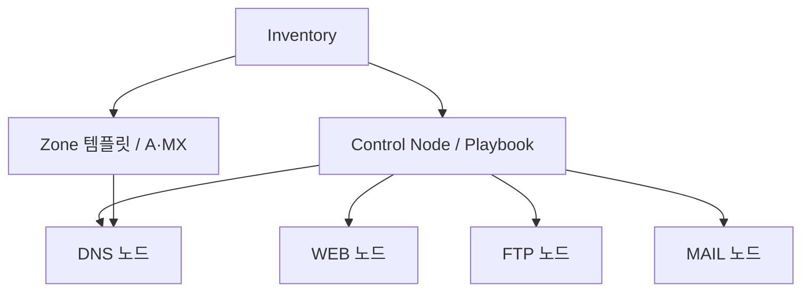

# Private Infrastructure Ansible Project

CentOS Stream 9의 DNS·WEB·FTP·MAIL 서버 구성을 Ansible Role로 자동화한 프로젝트다. 하나의 Playbook에서 공통 방화벽을 준비한 뒤, Inventory 그룹별로 패키지 설치·서비스 기동·설정 배포·방화벽 서비스 등록을 수행한다.

## 구성과 실행 흐름

기본 Inventory는 서비스별 Managed Node 4대를 사용한다. Control Node는 SSH로 각 노드에 접속하고 sudo로 설정을 적용한다.

| 대상 | Inventory 그룹 | 기본 주소 | 구성 |
|---|---|---|---|
| DNS | `dnsservers` | `192.168.10.11` | BIND: Inventory 기반 A·MX 레코드 |
| WEB | `webservers` | `192.168.10.12` | Apache HTTP Server: 기본 웹 페이지 |
| FTP | `ftpservers` | `192.168.10.13` | vsftpd: 익명 다운로드 |
| MAIL | `mailservers` | `192.168.10.14` | Postfix·Dovecot: SMTP·IMAP, Maildir |

[전체 Playbook](playbook.yml)은 **firewall → dns → web → ftp → mail** 순서로 실행한다. `firewall`은 전체 노드에 적용되며, 각 서비스 Role은 해당 그룹에만 적용된다.

DNS는 같은 [Inventory](inventory)의 호스트 주소와 `mailservers` 그룹을 참조해 이름 해석 정보를 생성한다. MAIL Role은 메일 서버 설정을 담당한다. DNS 구성과 메일 서버 구성은 서로 다른 호스트에서 실행되므로, Role dependency 대신 상위 Playbook에서 실행 순서를 관리한다. 클라이언트의 DNS 설정은 자동 변경하지 않는다.

다음은 구성 입력과 적용 대상의 관계다. 연결선은 서비스 간 트래픽이 아닌 설정 적용·참조 관계를 나타낸다.



## 주요 구현

- **공통 기반과 서비스 구성 분리:** `firewall`이 firewalld 설치·기동을 담당하고, 각 서비스 Role이 필요한 firewalld 서비스를 영구 설정과 실행 중 설정에 등록한다.
- **Inventory 기반 DNS 구성:** Jinja2로 Zone·Include·named 설정을 생성하고, Zone과 named 설정은 배포 시 각각 `named-checkzone`, `named-checkconf`로 검사한다.
- **변경 결과에 따른 재시작:** DNS·FTP·MAIL은 Task의 `changed` 결과를 모아 해당 서비스의 재시작 여부를 결정한다. WEB은 설정 파일을 수정하지 않고 기본 페이지를 배포한다.
- **기본 변수와 내부 변수 분리:** `defaults/main.yml`에는 환경별 조정값을, `vars/main.yml`에는 패키지·서비스명 등 Role 내부 값을 정의한다.

DNS Zone Serial은 날짜 기반 `YYYYMMDD01`이다. 날짜가 바뀌면 같은 Inventory로 실행해도 Zone 파일이 변경될 수 있으므로, 재실행 시 항상 변경이 없다고 보장하지 않는다.

## 실행 조건

기존 실습 환경은 Windows 10·VMware VMnet8 NAT, `192.168.10.0/24`, Control Node `192.168.10.10`, SELinux permissive로 기록되어 있다. VM 생성·OS 설치·SSH 계정 준비·SELinux 설정은 이 Playbook의 범위 밖이다.

- 대상 노드: CentOS Stream 9. 코드의 OS 검사는 `ansible_distribution == "CentOS"`이며, RHEL·Rocky·AlmaLinux까지 허용하지 않는다.
- Control Node: Ansible·ansible-navigator 설치 및 대상 노드로의 SSH 연결이 필요하다.
- 접속·권한: [ansible.cfg](ansible.cfg)의 기본 계정은 `ansible`, 권한 상승은 sudo/root이다. SSH 인증과 sudo 사용 조건을 사전에 준비한다.
- 의존성: 서비스 Role은 `ansible.posix.firewalld`를 사용한다. 실제 Ansible 실행 환경에서 `ansible.posix`를 사용할 수 있어야 한다.
- 버전: Role metadata의 최소 Ansible 표기는 `2.14`다. 실행 버전·Collection·패키지 버전을 고정하는 파일은 없으며, 모든 최신 조합의 호환성을 보장하지 않는다.

ansible-navigator의 Execution Environment 이미지·활성화 여부는 저장소에서 지정하지 않는다. 별도 Execution Environment를 사용한다면 그 안의 Collection과 SSH 접근 조건도 준비해야 한다.

## 실행

저장소 루트에서 실행한다. 먼저 Inventory의 주소·FQDN과 접속 계정을 실제 실습 환경에 맞춘다. 기본 DNS·MAIL 도메인은 Inventory 호스트명의 도메인 부분에서 계산한다.

```bash
ansible-galaxy collection install ansible.posix
ansible-navigator inventory -m stdout --list
ansible-navigator run -m stdout playbook.yml --syntax-check
ansible-navigator run -m stdout playbook.yml
```

위 명령은 구성 절차다. `--syntax-check`만으로 동적 Role 내부의 모든 실행 경로나 원격 서비스 동작이 검증되지는 않는다.

특정 그룹에만 적용하는 예:

```bash
ansible-navigator run -m stdout playbook.yml --limit webservers
```

이 경우 WEB 노드에 `firewall`과 `web`이 적용된다. `--limit mailservers`는 DNS 노드의 레코드를 갱신하지 않는다.

## 검증 범위

저장소에는 아래 테스트 Playbook이 있다. **모두 해당 Role을 다시 적용하므로 읽기 전용 점검이 아니다.** 서비스별 테스트는 firewalld가 이미 설치·기동되어 있어야 한다.

| 테스트 | 코드에 포함된 확인 | 확인하지 않는 범위 |
|---|---|---|
| [firewall](roles/firewall/tests/test.yml) | Role 재적용 | 별도 상태 검증 Task 없음 |
| [dns](roles/dns/tests/test.yml) | DNS 노드에서 A 응답에 Inventory IP가 포함되는지 검사 | MX 자동 검사·클라이언트 DNS 설정 |
| [web](roles/web/tests/test.yml) | WEB 노드에서 HTTP 200 검사 | 외부 클라이언트 접근·페이지 내용 검증 |
| [ftp](roles/ftp/tests/test.yml) | FTP 노드에서 기본 파일 다운로드 | 외부 경로·업로드 |
| [mail](roles/mail/tests/test.yml) | `postfix check`, `doveconf -n` 실행 | 실제 송수신·사용자 인증·인터넷 전달 |

예를 들어 전체 구성 후 DNS 테스트는 다음과 같이 실행한다.

```bash
ansible-navigator run -m stdout roles/dns/tests/test.yml
```

테스트 코드와 실행 절차는 존재하지만, 저장소에는 성공을 입증하는 실행 로그나 정량 측정 결과가 포함되어 있지 않다. 서비스 동작과 재실행 결과는 대상 환경에서 별도로 확인해야 한다.

## 적용 범위와 제한

이 구성은 **사설 실습망의 기본 서비스 구성**을 대상으로 한다. HA, VM Provisioning, TLS 인증서 관리, 메일 사용자 생성, 인터넷 메일 전달 구성은 포함하지 않는다.

DNS 템플릿은 `listen-on`·`allow-query`를 `any`로 설정하고 재귀 질의를 활성화한다. FTP는 익명 다운로드를 허용하며 MAIL은 `disable_plaintext_auth = no`를 설정한다. 인터넷 공개용 보안 구성을 제공하는 저장소로 해석해서는 안 된다.

WEB·FTP의 디렉터리 변수만 변경해도 서버의 DocumentRoot·익명 FTP 루트까지 바뀌는 것은 아니다. 경로 변경과 SELinux 적용 조건은 각 Role 문서에 설명한다.

## 상세 문서와 코드

공통 실행 조건은 이 README에서, 변수·적용 파일·점검 방법은 기존 Role 문서에서 다룬다.

| Role 문서 | 상세 내용 |
|---|---|
| [FIREWALL](roles/firewall/README.md) | 공통 서비스 상태와 서비스별 방화벽 등록의 경계 |
| [DNS](roles/dns/README.md) | Zone 생성·검사·Serial·Inventory 제약 |
| [WEB](roles/web/README.md) | 기본 페이지 관리·문서 경로·HTTP 점검 |
| [FTP](roles/ftp/README.md) | 익명 다운로드 설정·파일 배포·테스트 범위 |
| [MAIL](roles/mail/README.md) | Postfix·Dovecot 설정·DNS 관계·메일 검증 범위 |

코드 진입점은 `playbook.yml`과 각 Role의 `tasks/main.yml`이다. 서비스 Role은 패키지 → 서비스 기동 → 설정 → 방화벽 등록 순서이며, `firewall`은 패키지와 서비스 단계만 가진다. DNS 템플릿은 `roles/dns/templates/`, 테스트는 각 Role의 `tests/test.yml`에 있다.

작성자: tjung03. 각 Role에는 MIT [LICENSE](roles/dns/LICENSE)가 포함되어 있다.
