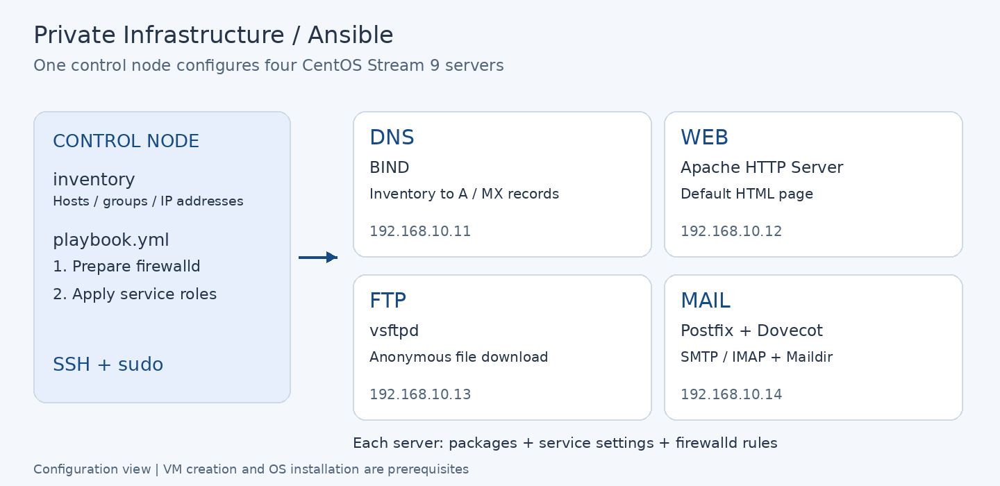

# Ansible로 구성하는 사설 서버 인프라

**서버마다 반복하는 설치·설정 작업을 하나의 Playbook으로 묶은 프로젝트다.**
사설 실습망의 CentOS Stream 9 서버 4대에 DNS, 웹, 파일 다운로드, 메일 서비스를 각각 구성한다.

관리자는 [Inventory](inventory)에 대상 서버를 정의하고 [Playbook](playbook.yml)을 실행한다.
Ansible은 SSH로 접속해 패키지 설치부터 서비스 기동, 설정 파일 배포, 방화벽 등록까지 처리한다.

## 무엇을 구성하는가



| 서버 | 구성되는 기능 | 구현 기술 |
|---|---|---|
| DNS | 서버 이름을 IP로 조회하고 메일 대상 서버를 찾는 A·MX 레코드 생성 | BIND · Jinja2 |
| WEB | 호스트·IP·OS 정보를 표시하는 기본 웹 페이지 배포 | Apache HTTP Server |
| FTP | 공개 디렉터리의 파일을 익명으로 다운로드하는 서비스 구성 | vsftpd |
| MAIL | 메일 전달·조회 서비스와 사용자 홈 기준 Maildir 경로 설정 | Postfix · Dovecot |

## 주요 구현

- **공통 기반과 서비스 구성 분리:** [상위 Playbook](playbook.yml)에서 모든 노드에 firewalld를 먼저 준비하고, 각 서비스 Role에서 필요한 방화벽 서비스를 등록한다.
- **Inventory 기반 DNS 생성:** [Jinja2 템플릿](roles/dns/templates/zone.j2)이 호스트 주소와 메일 서버 그룹을 A·MX 레코드로 변환한다. 서버 목록과 DNS 레코드를 같은 Inventory에서 관리한다.
- **배포 전 DNS 설정 검사:** [설정 Task](roles/dns/tasks/03_config.yml)의 `validate`로 Zone과 named 설정을 각각 검사한 뒤 배포한다.
- **변경된 서비스만 재시작:** [DNS](roles/dns/tasks/03_config.yml)·[FTP](roles/ftp/tasks/03_config.yml)·[MAIL](roles/mail/tasks/03_config.yml)은 설정·배포 Task의 `changed` 결과를 모아 재시작 여부를 결정한다. MAIL은 Postfix와 Dovecot의 변경을 각각 처리한다.
- **환경별 설정을 변수로 분리:** 각 Role의 `defaults/main.yml`에서 도메인·경로·콘텐츠 등을 조정하고, `vars/main.yml`에서 패키지·서비스명을 관리한다.

## 저장소 구조

```text
.
├── README.md
├── inventory                 # 서비스별 대상 서버
├── playbook.yml              # 전체 적용 순서
├── ansible.cfg               # 접속 계정·sudo·Role 경로
├── ansible-navigator.yml     # 실행 결과 파일 옵션
├── roles/
│   ├── firewall/             # 공통 firewalld 설치·기동
│   ├── dns/                  # BIND 구성, templates/ 포함
│   ├── web/                  # Apache 기본 페이지
│   ├── ftp/                  # 익명 다운로드
│   └── mail/                 # Postfix·Dovecot
└── docs/images/              # README 구성도
```

각 Role은 `defaults/`(조정값), `vars/`(내부 값), `tasks/`(적용), `tests/`(재적용·점검), `README.md`(상세 설명)를 중심으로 구성된다.

각 Role의 `tasks/main.yml`에서 적용 순서를, 아래 문서에서 변수와 설정 내용을 확인할 수 있다.

| Role 문서 | 상세 내용 |
|---|---|
| [FIREWALL](roles/firewall/README.md) | firewalld 기동·자동 시작과 서비스별 등록 |
| [DNS](roles/dns/README.md) | Zone 생성·검사·Serial·Inventory 구성 |
| [WEB](roles/web/README.md) | 기본 페이지 관리·문서 경로·HTTP 점검 |
| [FTP](roles/ftp/README.md) | 익명 다운로드 설정·파일 배포·다운로드 확인 |
| [MAIL](roles/mail/README.md) | Postfix·Dovecot 설정·DNS 관계·설정 확인 |

## 자동화가 실행되는 순서

1. **공통 준비:** 모든 대상 서버에 `firewall` Role을 적용해 firewalld를 설치·기동한다.
2. **서비스 구성:** `dns → web → ftp → mail` 순서로 각 Inventory 그룹에 해당 Role을 적용한다.
3. **동작 확인:** 구성 후 필요한 Role별 테스트를 별도로 실행한다.

DNS Role은 Inventory의 주소와 `mailservers` 그룹으로 레코드를 만들고, MAIL Role은 메일 서버 설정을 담당한다.
서로 다른 서버의 작업 순서는 상위 Playbook이 관리한다. 클라이언트 DNS 설정은 별도 준비가 필요하다.

## 실행 조건

기존 실습 환경은 Windows 10·VMware VMnet8 NAT, `192.168.10.0/24`, Control Node `192.168.10.10`, SELinux permissive로 기록되어 있다.

- 대상 노드: CentOS Stream 9. OS 검사 조건은 `ansible_distribution == "CentOS"`다.
- Control Node: Ansible·ansible-navigator 설치 및 대상 노드로의 SSH 연결이 필요하다.
- 접속·권한: [ansible.cfg](ansible.cfg)의 기본 계정은 `ansible`, 권한 상승은 sudo/root이다. SSH 인증과 sudo 사용 조건을 사전에 준비한다.
- 의존성: 서비스 Role은 `ansible.posix.firewalld`를 사용한다. 실제 Ansible 실행 환경에서 `ansible.posix`를 사용할 수 있어야 한다.

Execution Environment를 사용한다면 해당 환경에 Collection과 SSH 접근 조건을 준비한다. 서비스 패키지는 대상 노드의 패키지 저장소에서 `state: present`로 설치한다.

## 실행

Ansible·Collection 요구 버전과 Dovecot 설정 변경 사항은 [버전과 호환성](#버전과-호환성)에 정리했다.

저장소 루트에서 실행한다. 먼저 Inventory의 주소·FQDN과 접속 계정을 실제 실습 환경에 맞춘다. 기본 DNS·MAIL 도메인은 Inventory 호스트명의 도메인 부분에서 계산한다.

```bash
ansible-galaxy collection install ansible.posix
ansible-navigator inventory -m stdout --list
ansible-navigator run -m stdout playbook.yml --syntax-check
ansible-navigator run -m stdout playbook.yml
```

특정 그룹에만 적용하는 예:

```bash
ansible-navigator run -m stdout playbook.yml --limit webservers
```

이 경우 WEB 노드에 `firewall`과 `web`이 적용된다.

## 테스트와 확인 절차

각 테스트 Playbook은 해당 Role을 재적용한다. 서비스별 테스트는 firewalld가 설치·기동된 상태에서 실행한다.

| Playbook | 수행 내용 |
|---|---|
| [firewall](roles/firewall/tests/test.yml) | 모든 대상 노드에 firewalld 설치·서비스 상태 적용 |
| [dns](roles/dns/tests/test.yml) | DNS 노드에서 A 응답에 Inventory IP가 포함되는지 검사 |
| [web](roles/web/tests/test.yml) | WEB 노드에서 HTTP 200 응답 검사 |
| [ftp](roles/ftp/tests/test.yml) | FTP 노드에서 기본 파일 다운로드 |
| [mail](roles/mail/tests/test.yml) | MAIL 노드에서 `postfix check`, `doveconf -n` 실행 |

전체 구성 후 DNS 테스트를 실행하는 예:

```bash
ansible-navigator run -m stdout roles/dns/tests/test.yml
```

서비스별 상태 조회와 클라이언트 접근 확인 명령은 각 Role 문서에 정리했다.

## 버전과 호환성

공식 문서 확인일: **2026-09-05**.

| 저장소의 사용 항목 | 현재 상태·대응 항목 |
|---|---|
| Role metadata: 최소 Ansible `2.14` | Ansible Core 2.14는 2024-05-20 지원 종료 |
| `ansible.posix.firewalld` — Collection 버전 미지정 | 공식 문서의 `ansible.posix 2.2.2`는 Core `2.16+` 요구 |
| `ansible.builtin.systemd` | `ansible.builtin.systemd_service`의 유효한 별칭 |
| Dovecot `disable_plaintext_auth = no` | 2.4에서는 `auth_allow_cleartext = yes`에 대응 |
| Dovecot `mail_location = maildir:~/Maildir` | 2.4에서는 `mail_driver = maildir`, `mail_path = ~/Maildir`로 분리 |

Dovecot 2.4의 설정 형식 변경은 [MAIL Role의 호환성 문서](roles/mail/README.md#dovecot-24-호환성)에 정리했다.

공식 문서: [Ansible 유지보수 정책](https://docs.ansible.com/projects/ansible/latest/reference_appendices/release_and_maintenance.html) · [ansible.posix 요구 버전](https://docs.ansible.com/projects/ansible/latest/collections/ansible/posix/index.html) · [systemd 별칭](https://docs.ansible.com/projects/ansible/latest/collections/ansible/builtin/systemd_module.html) · [Dovecot 2.3 → 2.4](https://doc.dovecot.org/2.4.0/installation/upgrade/2.3-to-2.4.html)

작성자: tjung03. 각 Role에는 MIT [LICENSE](roles/dns/LICENSE)가 포함되어 있다.
